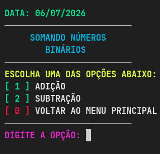

# 🔢 Calculadora de Números Binários e Auxiliar de Lógica


Uma ferramenta interativa via linha de comando (CLI) desenvolvida para centralizar conversões entre bases numéricas, aritmética binária e auxiliar no estudo de estruturas lógicas e álgebra booleana.

---

## 📌 1. Introdução

Os sistemas de numeração e a álgebra booleana são fundamentos essenciais para a compreensão da lógica computacional. A representação de valores em diferentes bases (decimal, binária, octal e hexadecimal) está presente em praticamente todas as áreas da computação, assim como as tabelas-verdade e mapas de Karnaugh.

Apesar de sua importância, esses conceitos costumam ser apresentados de forma abstrata durante o ensino inicial, o que pode dificultar a fixação por parte dos estudantes. Diante dessa necessidade, foi desenvolvido o projeto **Calculadora de Números Binários**, um programa que reúne conversões, operações aritméticas e ferramentas de apoio à simplificação lógica em uma única interface acessível.

---

## 💡 2. Justificativa

Estudantes que iniciam em lógica computacional frequentemente enfrentam dificuldades para realizar, manualmente, conversões entre bases numéricas e para montar tabelas-verdade extensas — processos que exigem atenção e repetição. Embora existam diversas calculadoras online para tarefas isoladas, poucas reúnem o conjunto completo necessário ao ambiente acadêmico.

Este projeto se justifica na criação de uma ferramenta **leve, sem dependências complexas e de fácil execução**, que sirva como apoio prático, permitindo ao usuário visualizar de forma imediata o resultado de cada operação e reforçar o entendimento por meio do feedback visual.

---

## 🎯 3. Objetivos

### 3.1 Objetivo Geral
Desenvolver uma ferramenta de linha de comando capaz de realizar conversões entre diferentes bases numéricas e auxiliar no estudo de lógica booleana, por meio de operações aritméticas binárias, geração de tabelas-verdade e simplificação de expressões via mapa de Karnaugh.

### 3.2 Objetivos Específicos
* **Conversões:** Implementar a conversão bidirecional entre os sistemas decimal, binário, octal e hexadecimal.
* **Aritmética Binária:** Implementar operações de adição e subtração com suporte flexível para 2, 3 ou 4 parcelas.
* **Tabela-Verdade:** Gerar tabelas-verdade para expressões booleanas com até 4 proposições (`a`, `b`, `c`, `d`).
* **Mapa de Karnaugh:** Oferecer uma ferramenta de apoio à montagem do mapa para 2, 3 ou 4 variáveis.
* **Interface Didática:** Proporcionar uma interface limpa com uso de cores estratégicas (ex: `0` para Falso/Vermelho e `1` para Verdadeiro/Verde).
* **Robustez:** Validar rigidamente as entradas do usuário, impedindo travamentos e quebras de execução.
* **Modulabilidade:** Estruturar o código-fonte em módulos independentes para facilitar manutenções futuras.

---

## ⚙️ 4. Escopo & Viabilidade Técnica

### 4.1 Descrição do Sistema
O sistema é um programa de terminal estruturado em menus e submenus navegáveis. O usuário pode saltar entre os módulos de conversão, realizar cálculos e retornar ao menu anterior ou encerrar o programa a qualquer momento de forma intuitiva.

### 4.2 Viabilidade Técnica
O projeto é altamente viável devido aos seguintes fatores:
* **Linguagem Base:** Construído inteiramente em **Python**, garantindo portabilidade multiplataforma (Windows, Linux ou macOS).
* **Cálculo Lógico:** Utilização da biblioteca de código aberto `ttg` (*table truth generator*) para a geração precisa e automatizada das tabelas-verdade.
* **Infraestrutura Zero:** Funciona **100% offline**, dispensando o uso de bancos de dados, servidores ou conexões externas à internet, resultando em custo zero de manutenção.

---

## 📊 5. Análise de Prós e Contras

| 👍 Pontos Positivos | 👎 Pontos Negativos |
| :--- | :--- |
| **Excelente ferramenta educacional** para lógica digital. | Interface **restrita ao modo texto** (linha de comando). |
| Simplicidade de uso (sem telas ou janelas complexas). | Dependência da biblioteca externa `ttg`. |
| **Feedback visual colorido** que facilita a leitura de dados. | **Sem persistência de dados** (não salva histórico). |
| Validação de strings contra entradas maliciosas ou inválidas. | |

---

## 🚀 6. Como Executar o Projeto
## 📸 Demonstração do Sistema

### Menu Principal


**Nesse momento o sistema pede para o usuário digitar a sua opção. Supomos ele escolheu a opção 1.**

### Conversão:

---
### Operações Binárias 

---
### Pré-requisitos 📝
* Certifique-se de ter o **Python 3.8 ou superior** instalado em sua máquina
* Instale o ttg na sua máquina

### 💻 Como Instalar o ttg em Qualquer Sistema Operacional
#### **🪟 Windows:**
Abra o Prompt de Comando (CMD) ou o PowerShell e execute:

    pip install truth-table-generator
#### **🍎 Mac:**
Abra o Terminal e garanta que está usando o gerenciador do Python 3:

    pip3 install truth-table-generator
#### **🐧 Linux:**

    # 1 - Instale o suporte a ambientes virtuais (caso não tenha)
    sudo apt update && sudo apt install python3-full -y

    # 2 - Crie e ative o ambiente na pasta do projeto
    python3 -m venv venv
    source venv/bin/activate

    # 3 - Instale a biblioteca com segurança
    pip install truth-table-generator
### 1. Clonar o Repositório
    ```bash
    git clone [https://github.com/AlanSouza003/numeros_binarios.git](https://github.com/AlanSouza003/meus-projetos.git)
    cd numeros_binarios