# 🔢 Calculadora de Números Binários e Auxiliar de Lógica


  <a href="https://github.com/AlanSouza003">
    
</a>


<p align="center">
    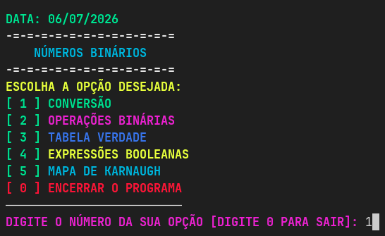
</p>


Uma ferramenta interativa via linha de comando (CLI) desenvolvida para centralizar conversões entre bases numéricas, aritmética binária e auxiliar no estudo de estruturas lógicas e álgebra booleana.

## 📑 Índice

- [✨ Funcionalidades](#-funcionalidades)
- [📌 Introdução](#-1-introdução)
- [💡 Justificativa](#-2-justificativa)
- [🎯 Objetivos](#-3-objetivos)
- [⚙️ Escopo e Viabilidade Técnica](#️-4-escopo--viabilidade-técnica)
- [📊 Análise de Prós e Contras](#-5-análise-de-prós-e-contras)
- [🚀 Como Executar o Projeto](#-6-como-executar-o-projeto)
- [📸 Demonstração do Sistema](#-demonstração-do-sistema)
- [👨‍💻 Autores](#-autores)

## ✨ Funcionalidades

- 🔄 Conversão entre Decimal, Binário, Octal e Hexadecimal
- ➕ Adição Binária
- ➖ Subtração Binária
- 📋 Geração de Tabelas-Verdade
- 🗺️ Auxílio para Mapas de Karnaugh
- 🎨 Interface colorida no terminal
- ✅ Validação de entradas

---

## 💻 Tecnologias Utilizadas

- **Python 3.8+** — Linguagem principal do projeto.
- **truth-table-generator (ttg)** — Geração automática de tabelas-verdade.
- **Git** — Controle de versão.
- **GitHub** — Hospedagem e versionamento do código-fonte.

---

## 📌 1. Introdução

Os sistemas de numeração e a álgebra booleana são fundamentos essenciais para a compreensão da lógica computacional. A representação de valores em diferentes bases (decimal, binária, octal e hexadecimal) está presente em praticamente todas as áreas da computação, assim como as tabelas-verdade e mapas de Karnaugh.

Apesar de sua importância, esses conceitos costumam ser apresentados de forma abstrata durante o ensino inicial, o que pode dificultar a fixação por parte dos estudantes. Diante dessa necessidade, foi desenvolvido o projeto **Calculadora de Números Binários**, um programa que reúne conversões, operações aritméticas e ferramentas de apoio à simplificação lógica em uma única interface acessível.

---

## 💡 2. Justificativa

Estudantes que iniciam em lógica computacional frequentemente enfrentam dificuldades para realizar, manualmente, conversões entre bases numéricas e para montar tabelas-verdade extensas — processos que exigem atenção e repetição. Embora existam diversas calculadoras online para tarefas isoladas, poucas reúnem o conjunto completo necessário ao ambiente acadêmico.

Este projeto se justifica na criação de uma ferramenta **leve, sem dependências complexas e de fácil execução**, que sirva como apoio prático, permitindo ao usuário visualizar de forma imediata o resultado de cada operação e reforçar o entendimento por meio do feedback visual.

---

## 🎯 3. Objetivos

### 3.1 Objetivo Geral
Desenvolver uma ferramenta de linha de comando capaz de realizar conversões entre diferentes bases numéricas e auxiliar no estudo de lógica booleana, por meio de operações aritméticas binárias, geração de tabelas-verdade e simplificação de expressões via mapa de Karnaugh.

### 3.2 Objetivos Específicos
* **Conversões:** Implementar a conversão bidirecional entre os sistemas decimal, binário, octal e hexadecimal.
* **Aritmética Binária:** Implementar operações de adição e subtração com suporte flexível para 2, 3 ou 4 parcelas.
* **Tabela-Verdade:** Gerar tabelas-verdade para expressões booleanas com até 4 proposições (`a`, `b`, `c`, `d`).
* **Mapa de Karnaugh:** Oferecer uma ferramenta de apoio à montagem do mapa para 2, 3 ou 4 variáveis.
* **Interface Didática:** Proporcionar uma interface limpa com uso de cores estratégicas (ex: `0` para Falso/Vermelho e `1` para Verdadeiro/Verde).
* **Robustez:** Validar rigidamente as entradas do usuário, impedindo travamentos e quebras de execução.
* **Modulabilidade:** Estruturar o código-fonte em módulos independentes para facilitar manutenções futuras.

---

## ⚙️ 4. Escopo & Viabilidade Técnica

### 4.1 Descrição do Sistema
O sistema é um programa de terminal estruturado em menus e submenus navegáveis. O usuário pode saltar entre os módulos de conversão, realizar cálculos e retornar ao menu anterior ou encerrar o programa a qualquer momento de forma intuitiva.

### 4.2 Viabilidade Técnica
O projeto é altamente viável devido aos seguintes fatores:
* **Linguagem Base:** Construído inteiramente em **Python**, garantindo portabilidade multiplataforma (Windows, Linux ou macOS).
* **Cálculo Lógico:** Utilização da biblioteca de código aberto `ttg` (*table truth generator*) para a geração precisa e automatizada das tabelas-verdade.
* **Infraestrutura Zero:** Funciona **100% offline**, dispensando o uso de bancos de dados, servidores ou conexões externas à internet, resultando em custo zero de manutenção.

---

## 📊 5. Análise de Prós e Contras

| 👍 Pontos Positivos | 👎 Pontos Negativos |
| :--- | :--- |
| **Excelente ferramenta educacional** para lógica digital. | Interface **restrita ao modo texto** (linha de comando). |
| Simplicidade de uso (sem telas ou janelas complexas). | Dependência da biblioteca externa `ttg`. |
| **Feedback visual colorido** que facilita a leitura de dados. | **Sem persistência de dados** (não salva histórico). |
| Validação de strings contra entradas maliciosas ou inválidas. | |

---

## 🚀 6. Como Executar o Projeto

### Pré-requisitos 📝
* Certifique-se de ter o **Python 3.8 ou superior** instalado em sua máquina.

### 1. Clonar o Repositório
Abra o terminal do seu computador e digite os comandos abaixo para baixar o projeto e acessar a pasta dele:

```bash
git clone https://github.com/AlanSouza003/numeros_binarios.git
cd numeros_binarios
```

### 2. Instalar a biblioteca ttg (Dependência)
Escolha o bloco de comandos correspondente ao seu sistema operacional:

#### 🪟 **Windows**:
Abra o **Prompt de Comando (CMD)** ou o **PowerShell e execute**:
```bash
pip install truth-table-generator
```
#### 🍎 **Mac**:
Abra o **Terminal** e garanta que está usando o gerenciador do **Python 3**:
```bash
pip3 install truth-table-generator
```
#### 🐧 **Linux**:
Abra o **Terminal** do Linux e configure o ambiente virtual para 
instalar a biblioteca com segurança e isolada do sistema:
```bash
# 1 - Instale o suporte a ambientes virtuais (caso não tenha)
sudo apt update && sudo apt install python3-full -y

# 2 - Crie e ative o ambiente na pasta do projeto
python3 -m venv venv
source venv/bin/activate

# 3 - Instale a biblioteca com segurança
pip install truth-table-generator
```
### 3. Rodar o Programa
Após concluir a instalação da biblioteca acima, basta iniciar o script principal:
```bash
python3 binarios.py
```
Ao executar esse comando, o menu principal da aplicação será exibido no terminal.

## 📸 Demonstração do Sistema
#### Menu Principal
<p align="center">
    
</p>

* **Nesse momento o sistema pede para o usuário digitar a sua opção. Supomos que ele escolheu a opção 1.**

#### Conversões Binárias
<p align="center">
    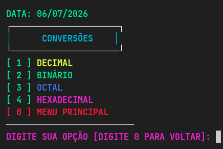
</p>

* **O sistema apresenta ao usuário quatro opções de conversão entre bases numéricas.**

    1. **Decimal**
    2. **Binário**
    3. **Octal**
    4. **Hexadecimal**

#### Conversão de Decimal para Binário
<p align="center">
    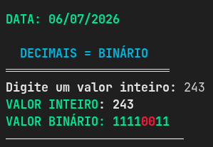
</p>

#### Operações Binárias
<p align="center">
    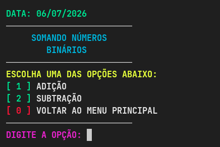
</p>

* **O sistema disponibiliza as opções de adição e subtração para realização dos cálculos**

#### Menu de parcelas
<p align="center">
    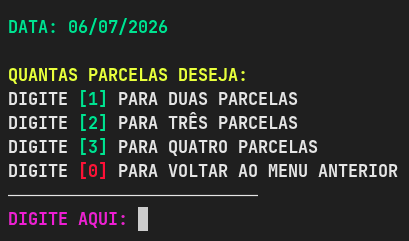
</p>

* **O usuário escolhe a quantidade de parcelas**

#### Adição com 2 Parcelas
<p align="center">
    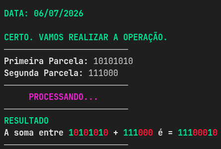
</p>

### Tabela-Verdade
#### Escolha das proposições
<p align="center">
    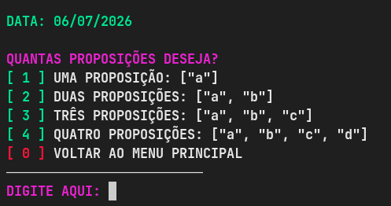
</p>

* **Neste menu, o usuário escolhe a quantidade de proposições que serão exibidas na tabela-verdade.**

#### Proposição de A até C
<p align="center">
    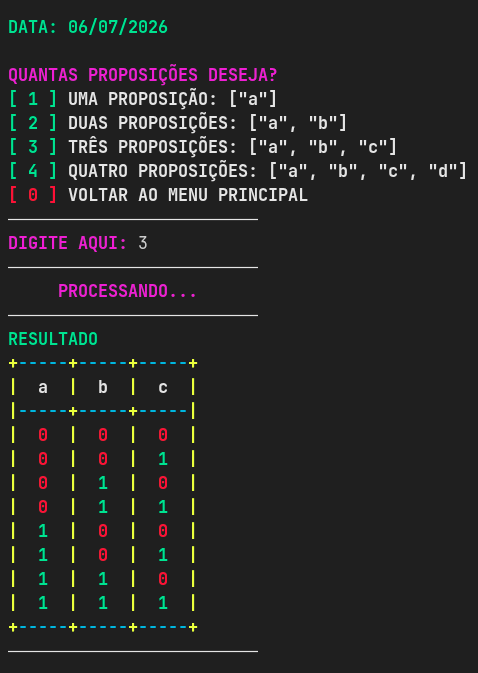
</p>

#### Expressões Booleanas
<p align="center">
    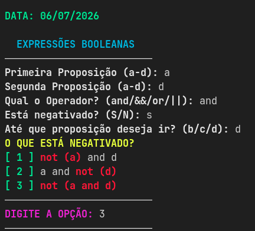
</p>

* **Na aba de expressões booleanas, o sistema vai pedir para o usuário digitar a primeira e a segunda proposição. Depois vai perguntar qual operador ele deseja utilizar e também vai perguntar se a operação está negada, e por último até qual proposição o usuário deseja ir.**
### Exibição da tabela com o valor negado
<p align="center">
    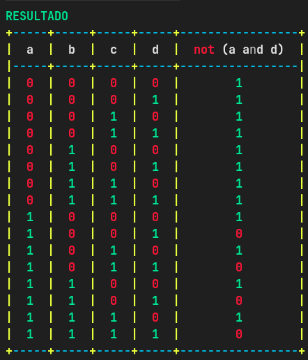
</p>

#### Menu do Mapa Karnaugh
<p align="center">
    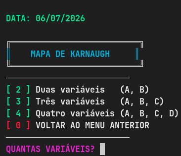
</p>

* **O usuário escolhe a quantidade de variáveis para gerar o mapa de Karnaugh.**
### Preenchendo o Mapa com 4 variáveis
<p align="center">
    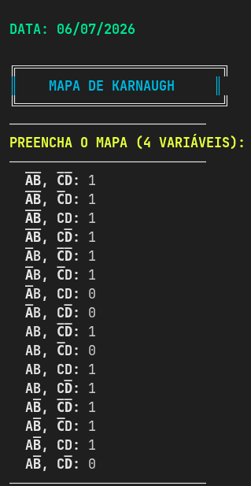
</p>

* **Preenchendo o mapa**
#### Mapa de Karnaugh
<p align="center">
    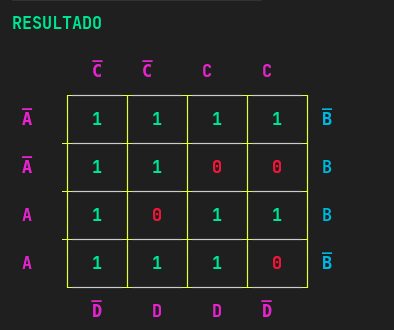
</p>

## 👨‍💻 Autores

Desenvolvido por:

- Alan Souza
- Alexandre
- Gabriel
- Jovane
- Thiago
- Vinicius

Este projeto foi desenvolvido como trabalho acadêmico, com o objetivo de auxiliar no estudo de sistemas de numeração, operações binárias, lógica booleana e mapas de Karnaugh.